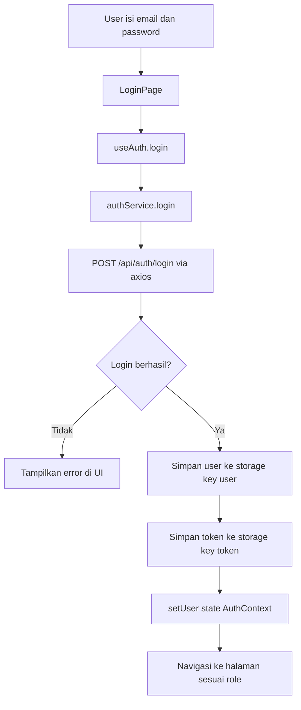
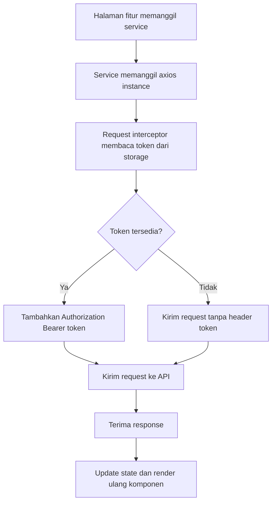

# Arsitektur Sistem Frontend

Dokumen ini menjelaskan alur sistem frontend saja (React + Vite) berdasarkan implementasi saat ini.

## 1. Diagram Alur Utama Frontend

```mermaid
flowchart TD
    U[Pengguna] --> B[Browser]
    B --> M[src/main.jsx]
    M --> A[src/app/App.jsx]
    A --> P[src/app/providers.jsx]
    P --> C[AuthProvider useAuth]
    C --> R[RouterProvider]
    R --> RT[src/app/router.jsx]

    RT --> L[/login]
    RT --> D[/doctor/*]
    RT --> AD[/admin/*]

    L --> SVC[auth.service login]
    SVC --> AX[Axios Instance src/lib/axios.js]
    AX --> API[(REST API)]
    API --> AX
    AX --> ST[storage simpan user + token]
    ST --> C
```

## 2. Diagram Routing Frontend

```mermaid
flowchart LR
    ROOT[/] --> LOGIN[/login]
    WILDCARD[*] --> LOGIN

    LOGIN --> DROOT[/doctor]
    LOGIN --> AROOT[/admin]

    DROOT --> DDASH[/doctor/dashboard]
    DROOT --> DCREATE[/doctor/prescription/create]
    DROOT --> DSTATUS[/doctor/prescription/status]
    DROOT --> DDETAIL[/doctor/prescription/:id]

    AROOT --> ADASH[/admin/dashboard]
    AROOT --> AMED[/admin/medicine]
    AROOT --> ASTOCK[/admin/stock]
    AROOT --> AINCOMING[/admin/incoming-request]
    AROOT --> AAPPROVAL[/admin/prescription-approval]
    AROOT --> AREQ[/admin/request/create]
    AROOT --> ADETAIL[/admin/prescription/:id]
```

## 3. Diagram Login dan Penyimpanan Session (Frontend)



## 4. Diagram Request API dari Frontend



## 5. Ringkasan Komponen Kunci Frontend

1. Bootstrapping aplikasi: `src/main.jsx`
2. Root app dan router: `src/app/App.jsx`
3. Auth context provider: `src/app/providers.jsx`, `src/hooks/useAuth.jsx`
4. Definisi route: `src/app/router.jsx`
5. HTTP client + token interceptor: `src/lib/axios.js`
6. Utility guard yang tersedia: `src/utils/ProtectedRoute.jsx`, `src/utils/RoleGuard.jsx`
